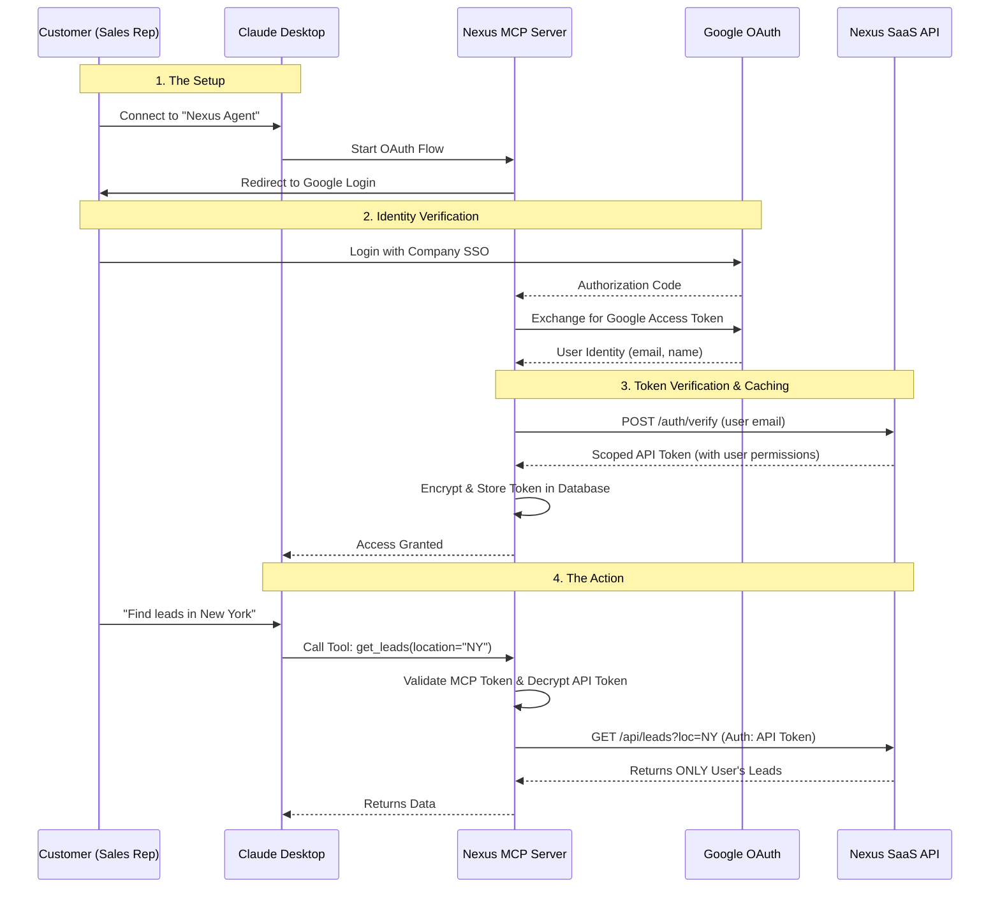
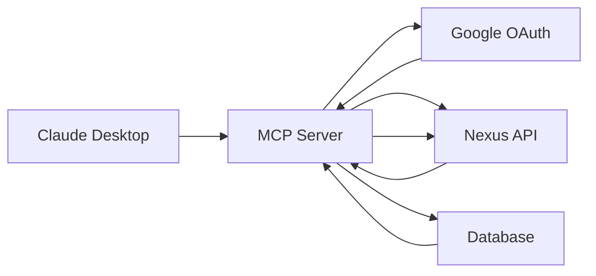
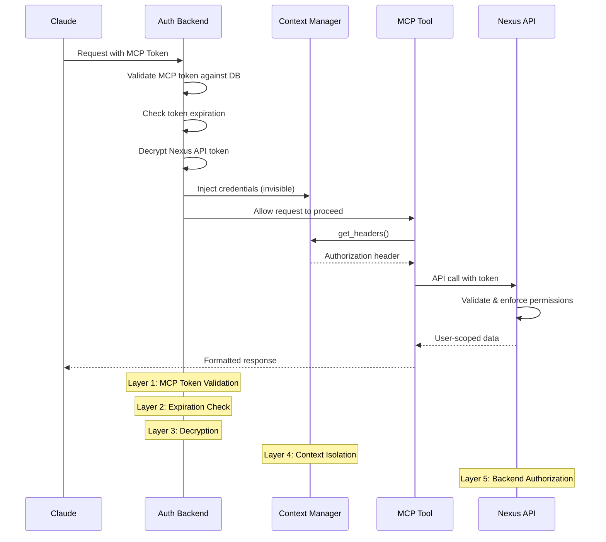
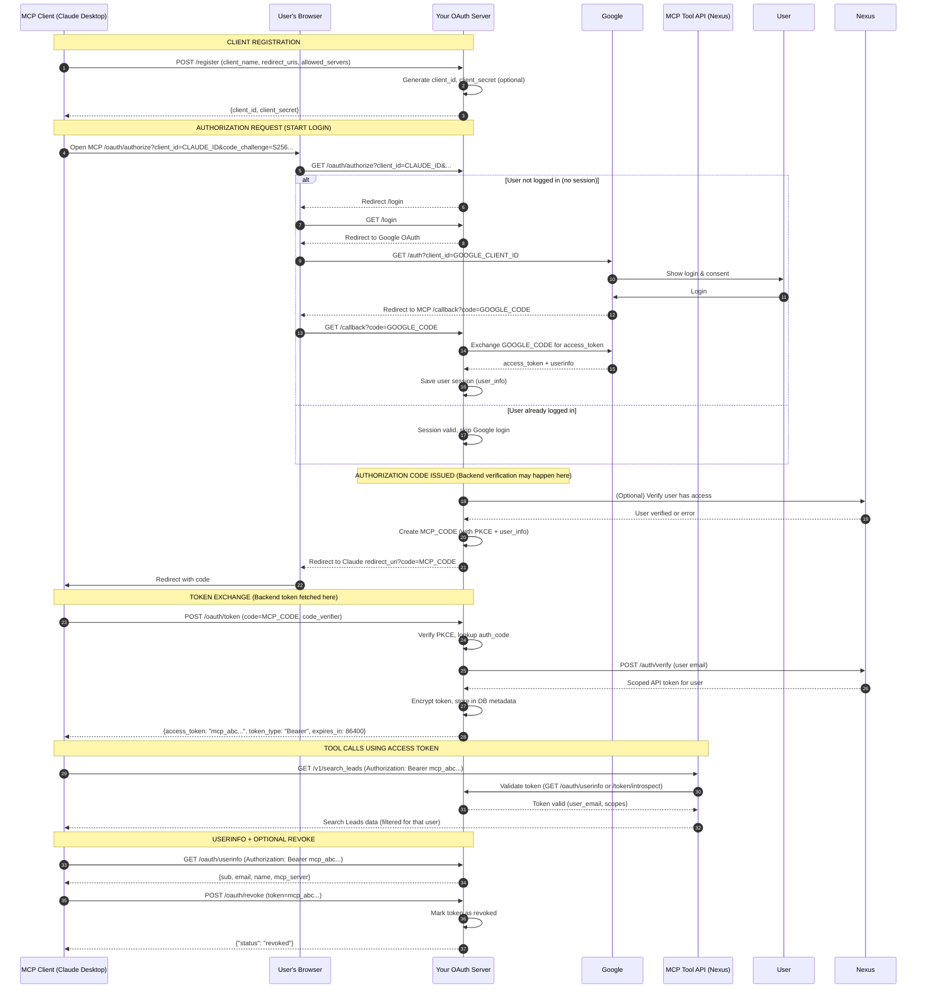

## Introduction

Every B2B SaaS company today faces the same request: *"Can I connect your platform to my AI agent?"*

Your customers want to use Claude Desktop or Cursor to interact with their data—leads in your CRM, tickets in your HelpDesk, or infrastructure in your Cloud Dashboard.

But exposing your B2B API directly to an LLM client is dangerous. You cannot ask customers to paste high-privilege API keys into third-party tools. You need a **Secure Bridge**.

In this guide, we will build a production-ready Model Context Protocol (MCP) server for **"Nexus"** (our fictional B2B CRM). We will implement:
1.  **OAuth 2.1** for secure customer login (using **Google as our Identity Provider**).
2.  **Multi-Tenant Isolation** to ensure Customer A never sees Customer B's data.
3.  **Scoped Token Propagation** to reuse your existing API permissions.

### The Identity Flow
In our implementation, when a user wants to connect Claude to Nexus:
- They authenticate via **Google OAuth** (leveraging your company's existing SSO)
- Your MCP server verifies the user's identity with your **Nexus backend** and receives an API token
- This Nexus token is encrypted and stored in your database for subsequent API calls

This means you don't need to build custom authentication—you leverage your existing identity infrastructure.

## The Architecture: The "Bridge" Pattern

We aren't rewriting our SaaS security. We are leveraging it. The MCP Server acts as a proxy that translates "Natural Language Intent" (from Claude) into "Scoped API Calls" (to your Backend).



### Why this works for Enterprise
* **Zero Database Access:** The MCP server has no direct DB credentials. It can only do what the *specific logged-in user* can do via your backend API.
* **User-Scoped Tokens:** Each MCP session is tied to a specific user's backend token, ensuring proper data isolation.
* **Token Rotation:** If the user is removed from your system, their backend token becomes invalid on the next API call.
* **No Shared Secrets:** Users never handle API keys. It's a pure OAuth flow with encrypted token storage.
* **SSO Integration:** By using Google OAuth, you leverage existing identity infrastructure (including MFA, conditional access policies, etc.).
* **Encrypted Storage:** Backend tokens are encrypted (AES-256-GCM) before storage and only decrypted at request time.

### Understanding the Two OAuth Flows

It's important to understand there are **two separate OAuth flows** happening:

**Flow 1: Claude ↔ Your MCP Server**
- Claude acts as the OAuth client
- Your MCP server is the authorization server
- Issues an "MCP Token" that Claude includes in every request
- This token is just a session identifier—it has no backend permissions

**Flow 2: Your MCP Server ↔ Google → Nexus Backend**
- Your MCP server acts as the OAuth client for Google
- Google provides user identity (email, name)
- Your MCP server verifies the user with your Nexus backend (`/auth/verify`)
- Nexus backend returns a scoped API token for that user
- This token has real permissions and can access customer data

The MCP Server sits in the middle, translating between these two flows. The key insight: **backend tokens are fetched during MCP token creation (token exchange), not during authorization**.



## Implementation: The "Scoped Token" Strategy

The secret sauce is how we handle the **Scoped Token**. We don't want the user to log in for every single question. We need a way to persist their identity securely during the conversation.

We will use a **Encryption-at-Rest** strategy within our session management.

<CodeGroup>

```python oauth_service.py
# Phase 1: Token Exchange During Authorization Code Redemption
# This happens when Claude exchanges the authorization code for an MCP token

async def exchange_code_for_token(
    self, 
    code: str, 
    code_verifier: str,
    client_id: str
):
    # 1. Verify the OAuth 2.1 Handshake (PKCE validation)
    auth_code = await self.code_repo.validate_code(code, code_verifier)
    
    # 2. The auth_code already contains Google user info from the authorization flow
    # (email was verified when the authorization code was created)
    user_email = auth_code.user_email
    
    # 3. Verify user access with your Nexus backend
    # This is where your backend validates the user and returns a scoped API token
    nexus_response = await self.http_client.post(
        "https://api.nexus-crm.com/auth/verify",
        headers={
            "Authorization": f"Bearer {self.settings.NEXUS_ADMIN_TOKEN}"
        },
        json={
            "email": user_email
        }
    )
    
    if nexus_response.status_code != 200:
        raise ValueError("User not authorized for Nexus access")
    
    scoped_api_token = nexus_response.json().get("access_token")
    user_id = nexus_response.json().get("user_id")
    
    # 4. Encrypt this token before storing it in the database
    # We NEVER store backend tokens in plaintext
    encrypted_token = self.encryption.encrypt(scoped_api_token)
    
    # 5. Create the MCP Token (this is what Claude will send in future requests)
    mcp_token = f"mcp_{secrets.token_urlsafe(32)}"
    
    await self.token_repo.save_token(
        token=mcp_token,
        client_id=client_id,
        user_email=user_email,
        user_id=user_id,
        metadata={
            "nexus_token_encrypted": encrypted_token,
            "expires_at": time.time() + 86400  # 24 hours
        }
    )
    
    # 6. Mark the authorization code as used (one-time use only)
    await self.code_repo.mark_code_as_used(code)
    
    return {
        "access_token": mcp_token,
        "token_type": "Bearer",
        "expires_in": 86400
    }
```

```python auth_backend.py
# Phase 2: Token Validation & Context Injection
# This authentication backend runs on EVERY request from Claude before any tool executes.
# Uses Starlette's AuthenticationMiddleware pattern

from starlette.authentication import AuthenticationBackend, AuthCredentials, SimpleUser
from starlette.requests import Request

class OAuthAuthBackend(AuthenticationBackend):
    def __init__(self):
        self.encryption = TokenEncryptionService()
        
    async def authenticate(self, request: Request):
        # 1. Extract the MCP Token from Claude's request
        auth_header = request.headers.get("Authorization")
        if not auth_header or not auth_header.startswith("Bearer "):
            return None  # Unauthenticated
        
        mcp_token = auth_header.split(" ")[1]
        
        # 2. Validate the MCP Token against the database
        token_record = await self.token_repo.get_token(mcp_token)
        if not token_record or token_record.revoked:
            return None  # Invalid token
        
        # 3. Check if the token has expired
        if token_record.expires_at < datetime.now(timezone.utc):
            return None  # Expired token
        
        # 4. Decrypt the Nexus API Token from metadata
        try:
            nexus_token = self.encryption.decrypt(
                token_record.metadata["nexus_token_encrypted"]
            )
        except Exception as e:
            logger.error(f"Token decryption failed: {e}")
            return None
        
        # 5. Inject into Thread-Safe Context
        # This makes the token available to all tools without passing it explicitly
        set_user_context(
            user_id=token_record.user_id,
            access_token=nexus_token,
            user_email=token_record.user_email
        )
        
        # 6. Return authenticated user
        return AuthCredentials(["authenticated"]), SimpleUser(token_record.user_email)

# In your MCP server setup:
# app.add_middleware(AuthenticationMiddleware, backend=OAuthAuthBackend())
```
</CodeGroup>

## The Request Lifecycle: From Claude to Your API

Before we write tools, let's understand the **complete validation chain** that happens on every request:



This multi-layer validation ensures:
- **Layer 1 (MCP Token)**: Proves the user authenticated with your MCP server
- **Layer 2 (Expiration Check)**: Prevents stale sessions
- **Layer 3 (Decryption)**: Validates token integrity
- **Layer 4 (Context Isolation)**: Prevents token leakage to LLM
- **Layer 5 (Backend Validation)**: Your Nexus API enforces user permissions

If **any** layer fails, the request is rejected before reaching your data.

##  The Engine Room - Writing Secure Tools

Now that we have a secure session, how do we use it?

A naive developer might pass the `api_token` as an argument to every tool:
`get_leads(api_token: str, search_term: str)`.

**Do not do this.**
1.  It leaks the token into the LLM conversation history (security risk).
2.  It confuses the model (why does it need to know about tokens?).
3.  It's brittle.

Instead, we use **Context Injection**. The tool shouldn't know *how* it's authenticated, just that it *is*.

### Step 1: The Context Manager
First, we define a thread-safe (and async-safe) storage for our user data. This acts as a "teleportation tunnel" from our Middleware directly to our Tools.

<CodeGroup>
```python title="app/context.py"
from contextvars import ContextVar
from typing import Optional
from dataclasses import dataclass

@dataclass
class UserContext:
    """User context data structure."""
    user_id: Optional[str] = None
    user_email: Optional[str] = None
    access_token: Optional[str] = None

# The "Magic Variable"
# This variable is local to the specific request/thread.
# It cannot be seen by other users or concurrent requests.
_user_context: ContextVar[Optional[UserContext]] = ContextVar(
    "user_context", 
    default=None
)

def set_user_context(
    user_id: Optional[str] = None,
    user_email: Optional[str] = None,
    access_token: Optional[str] = None
):
    """
    Called by Authentication Backend at the start of EVERY request.
    This injects the user's credentials into a thread-safe context.
    """
    context = UserContext(
        user_id=user_id,
        user_email=user_email,
        access_token=access_token
    )
    _user_context.set(context)

def get_user_context() -> Optional[UserContext]:
    """Get the current user context."""
    return _user_context.get()

def get_current_user() -> Optional[str]:
    """Helper to get the current user's email (useful for audit logs)"""
    context = get_user_context()
    return context.user_email if context else None

def clear_user_context():
    """Clear the current user context after request completion."""
    _user_context.set(None)
```

</CodeGroup>


## Step 2: The "Dumb" Tool Principle
Now we write the MCP tool. Notice how clean it is. There is no authentication logic visible here. It retrieves credentials from context and makes API calls.

```python
from fastmcp import FastMCP
from app.context import get_user_context
import aiohttp

mcp = FastMCP("Nexus Leads")

def get_headers() -> dict:
    """Retrieve authentication headers from user context."""
    user_context = get_user_context()
    
    if not user_context or not user_context.access_token:
        raise ValueError("User context not initialized - authentication required")
    
    return {
        "Authorization": f"Bearer {user_context.access_token}",
        "Content-Type": "application/json"
    }

@mcp.tool
async def search_leads(query: str, industry: str = None) -> str:
    """
    Search for sales leads in the CRM. 
    Returns only leads the authenticated user is allowed to see.
    """
    # The tool retrieves auth automatically from context
    headers = get_headers()
    
    async with aiohttp.ClientSession() as session:
        async with session.get(
            "https://api.nexus-crm.com/leads/search",
            headers=headers,
            params={"q": query, "industry": industry}
        ) as response:
            if response.status == 401:
                return "Authentication failed. Please restart the conversation."
            
            if response.status == 403:
                return "Access denied to this resource."
            
            results = await response.json()
    
    if not results:
        return "No leads found matching your criteria."
        
    # Format as markdown table
    return format_as_table(results)

def format_as_table(data: list) -> str:
    """Helper to format results for Claude."""
    if not data:
        return "No results found."
    
    headers = data[0].keys()
    table = "| " + " | ".join(headers) + " |\n"
    table += "| " + " | ".join(["---"] * len(headers)) + " |\n"
    
    for row in data:
        table += "| " + " | ".join(str(row.get(h, "")) for h in headers) + " |\n"
    
    return table
```

## Step 3: Key Implementation Details

### Token Storage in Database
Instead of session storage, tokens are persisted in MongoDB for durability:

```python token_repository.py
async def save_token(
    self,
    token: str,
    client_id: str,
    user_email: str,
    user_id: str,
    metadata: dict
):
    """Save MCP token with encrypted Nexus API token in metadata."""
    token_record = {
        "token": token,
        "client_id": client_id,
        "user_email": user_email,
        "user_id": user_id,
        "token_type": "Bearer",
        "issued_at": datetime.now(timezone.utc),
        "expires_at": datetime.now(timezone.utc) + timedelta(hours=24),
        "revoked": False,
        "metadata": metadata  # Contains "nexus_token_encrypted"
    }
    
    await self.db.oauth_mcp_tokens.insert_one(token_record)

async def get_token(self, token: str):
    """Retrieve token record from database."""
    return await self.db.oauth_mcp_tokens.find_one({"token": token})
```

### MCP Server Setup with Authentication
Here's how to wire everything together:

```python mcp_server.py
from fastmcp import FastMCP
from starlette.middleware.authentication import AuthenticationMiddleware
from starlette.applications import Starlette
from app.auth_backend import OAuthAuthBackend

# Create your MCP server with tools
mcp = FastMCP(
    name="Nexus-MCP-Server",
    instructions="MCP server for Nexus CRM operations"
)

# Add your tools
@mcp.tool
async def search_leads(query: str):
    # ... tool implementation using get_headers()
    pass

# Create ASGI app with authentication
app = Starlette()
app.add_middleware(
    AuthenticationMiddleware,
    backend=OAuthAuthBackend()  # This handles token validation & context injection
)

# Mount MCP server
app.mount("/mcp/sse", mcp.get_asgi_app())
```

## The Final Request Flows




## User Experience

### How does this look to the end user?

#### **Configuration**
They add your MCP server to their `claude_desktop_config.json`:

```json
{
  "mcpServers": {
    "nexus": {
      "type": "http",
      "url" : "https://mcp.nexus.com"
    }
  }
}
```

#### **First-Time Setup**
1. They open Claude Desktop and try to use a Nexus command
2. Claude redirects them to your MCP server's OAuth flow
3. They're redirected to **Google Sign-In** (using their company email)
4. After Google authentication, they're redirected back to Claude
5. Your MCP server exchanges the Google identity for a Nexus API token

#### **The Magic**
Once logged in, they just type. No more authentication needed for the session.

**User:**  
> "Show me the latest leads for Pepsi."

**Claude:**  
*(Calls `search_leads`)*

**MCP Server:**  
*(Decrypts token → Injects into Header → Calls API)*

**Claude:**  
> "Here are the 3 latest leads for Pepsi..."


## Handling Edge Cases & Security Considerations

### What happens when tokens expire?

When the Nexus API token expires (typically after 1 hour), the next request will fail with a 401. Your tool should handle this gracefully:

```python
async def search_leads(query: str):
    headers = get_headers()
    
    async with aiohttp.ClientSession() as session:
        async with session.get(
            "https://api.nexus-crm.com/leads/search",
            headers=headers,
            params={"q": query}
        ) as response:
            if response.status == 401:
                # Backend token expired - prompt re-authentication
                return "Your session has expired. Please restart the conversation to re-authenticate."
            
            return await response.json()
```

Claude Desktop will display this message to the user, who can then re-authenticate via the OAuth flow.

### What if a user's permissions change?

Since you're using scoped tokens from your Nexus backend, permission changes are automatically enforced:

1. **User is removed from your system**: The Nexus API will return 401 on the next request
2. **User's role is downgraded**: The API only returns data the new role permits
3. **User's access is revoked**: The backend verification endpoint will fail on next login

The MCP server doesn't need to track permissions—it relies entirely on your existing backend's enforcement.

### Preventing Token Leakage to LLM

**Critical**: Never let the token appear in:
- Function parameters: `get_leads(api_token: str)` 
- Tool descriptions visible to the LLM
- Error messages returned to Claude
- Logs that might be sent to Claude for debugging

Always use the Context pattern. The LLM should never be aware authentication exists.

### Rate Limiting & Abuse Prevention

Since each MCP token maps to a real user, apply rate limits in your authentication backend:

```python
class OAuthAuthBackend(AuthenticationBackend):
    async def authenticate(self, request: Request):
        # ... token validation ...
        
        # Apply rate limiting per user
        await rate_limiter.check_limit(
            key=f"mcp:{token_record.user_email}",
            limit=100,  # requests per minute
            window=60
        )
        
        return AuthCredentials(["authenticated"]), SimpleUser(token_record.user_email)
```

This prevents a malicious actor from abusing Claude to spam your API.

## Conclusion

We have moved beyond "Toy MCP Servers."

By combining **Google OAuth for identity**, **Database-Backed Token Storage**, **Context Propagation for state isolation**, and **Scoped Tokens for access control**, we've built a system that is:

- **Secure:** No shared API keys. Users authenticate via their company SSO.
- **Private:** User-scoped tokens ensure proper data isolation. Multi-layer validation prevents data leakage.
- **Auditable:** Every API call is tied to a real user identity for compliance.
- **Usable:** The end user just chats; the rigorous security happens transparently.

This is the architecture required to take AI Agents from **Localhost Experiments → Enterprise Production**.

### Key Takeaways

1. **Use your existing identity provider** (Google, Okta, etc.) instead of building custom auth
2. **Never store unencrypted backend tokens** in your database - always use AES-256-GCM encryption
3. **Leverage context variables** to keep auth invisible to tools and LLMs
4. **Validate at multiple layers**: MCP token → Expiration → Decryption → Backend API
5. **Design for expiration**: Tokens should be short-lived (24 hours) and re-authenticatable
6. **Use Starlette's AuthenticationMiddleware** for clean separation of auth logic from business logic

The MCP server is just a **secure bridge**—all the real security and business logic stays in your existing backend where it belongs.
