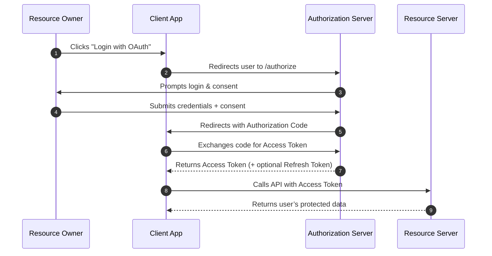
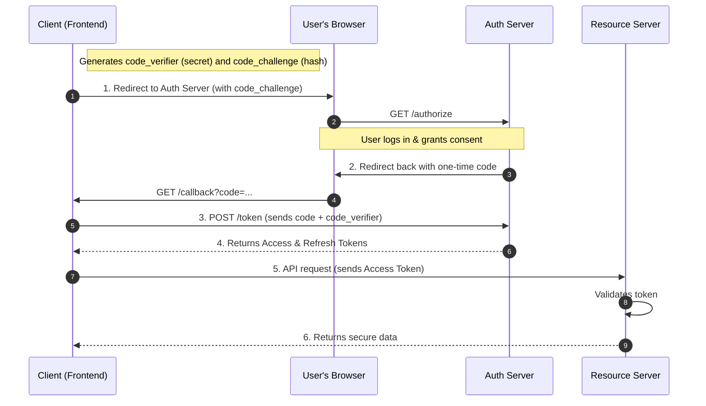

If you've ever built an application that needs to securely interact with another application's data, you've encountered OAuth.  
And if you're like most developers, you’ve likely been confused by its “grant types,” “flows,” and the subtle differences between OAuth 2.0 and 2.1.

The biggest point of confusion?  
**OAuth 2.0** was a framework, not a protocol. It gave developers a toolbox  some tools were powerful, some were dangerous.

**OAuth 2.1**, on the other hand, is the cleaned-up, security-focused specification.  
It isn’t new, it simply removes insecure flows and mandates the best practices that were already recommended.

This guide explains OAuth from the ground up using a practical microservice architecture with a React frontend and Node.js backend.

## <Icon icon="users"  size={32}/> Part 1: The Cast of Characters (The Four Roles)

OAuth defines four primary roles.  
Let’s understand them in the context of a real-world system with a React Frontend, Node.js service, and a Database.

## <Icon icon="user" size={24}/> 1. The Resource Owner (The End-User)

**Who they are:** The human end-user sitting at their browser or mobile phone.  
**Technical Identity:** A record in your `users` table (e.g., `user_id: 123`) with a username and a hashed password.  
**Core Responsibility:** To own the data and grant permission.  
**Their Action:** Logs in and clicks the “Allow” button on a consent screen.

## <Icon icon="computer"  size={28}/> 2. The Client (The Application)

**Who they are:** The application that wants to access user data.  
**Technical Identity:**  
  - **Frontend App:** Your React, Vue, or Angular SPA running in the browser.  
  - **Backend App:** A third-party or internal microservice (e.g., a reporting service needing access to the orders API).  

**Core Responsibility:** To initiate authorization and later use the token to access protected data.  
**Their Action:** Redirects the user to the Authorization Server and later attaches the token in an `Authorization` header on API calls.

## <Icon icon="shield-check"  size={28}/> 3. The Authorization Server (Auth Service)

**Who they are:** The gatekeeper service that handles authentication and token issuance.  
**Technical Identity:** A backend service (like `auth.your-api.com`, or a third-party provider such as  Google, Okta or Auth0).  

**Core Responsibilities:**
1. **Authenticate the user** — serve the login page and validate credentials.  
2. **Request user consent** — display a screen asking, “Allow this app to access your data?”  
3. **Issue tokens** — once the user consents, issue an **Access Token** (and optionally a **Refresh Token**) to the Client.

It does not hold user data. Only manages authentication and authorization.

##  <Icon icon="database"  size={28}/>  4. The Resource Server (The Data Service)

**Who they are:** The backend APIs that actually store or expose user data.  
**Technical Identity:** Your data services (e.g., `profile.your-api.com`, `orders.your-api.com`, etc.).  
**Core Responsibility:** To protect and serve user data.  
**Their Action:**
1. Looks for the `Authorization` header containing the Access Token.  
2. Validates the token (signature, expiration, and scope).  
3. If valid → executes business logic and returns JSON data.  
4. If invalid or expired → returns 401 Unauthorized.

###  <Icon icon="list"  size={28}/>  Summary of Roles

| Role | Technical Component | Main Job |
| :--- | :--- | :--- |
| **Resource Owner** | Human User | Grants permission (clicks "Allow") |
| **Client** | Frontend or another Backend | Requests access, sends the token |
| **Authorization Server** | Auth Service (`auth.api.com`) | Verifies user, issues tokens |
| **Resource Server** | Data Service (`api.api.com`) | Protects data, validates tokens |

**Key Principle:**  
The **Authorization Server** and **Resource Server** are separate.  
The server that *issues* tokens is not the one that stores user data  they just trust each other.

## <Icon icon="file-text"  size={28}/> Part 2: The Key OAuth Artifacts (The “Jargon”)

| Artifact | Description |
| :--- | :--- |
| **Access Token** | Short-lived (e.g., 15 min) credential — sent to the Resource Server with API calls. |
| **Refresh Token** | Long-lived (e.g., 30 days) credential — exchanged for new Access Tokens (sent only to the Auth Server). |
| **Authorization Code** | Short-lived (60 sec) one-time-use code exchanged for real tokens. |
| **Scope** | Defines permissions, e.g., `read:profile`, `write:orders`. Enforces least privilege. |
| **Client ID / Secret** | The credentials of the Client app. The `client_secret` **must never** exist in a frontend app. |

## <Icon icon="network" size={28}/> Part 3: How OAuth 2.0 Worked (Before 2.1)

Before we discuss why OAuth 2.0 became messy, let’s recall how it was *supposed* to work.

OAuth 2.0 introduced the **Authorization Code Grant**, the foundation for delegated access between a client app and a protected API.

### <Icon icon="refresh-ccw" size={24}/> The OAuth 2.0 Authorization Code Flow

## ⚠️ Part 3: OAuth 2.0’s Chaos — The Insecure Flows

When OAuth 2.0 was published in **2012**, it included flows that made sense for early web apps but are now insecure.  
OAuth 2.1’s primary goal was to **remove** these flows.

### The “Implicit” Grant (Removed)

**What it was:**  
A flow for frontend-only apps that returned the **Access Token** directly in the URL (e.g., `#token=abcd...`).  

**Why it’s bad:**  
Tokens could be leaked in:
- Browser history  
- Server logs  
- Referrer headers  

Never use this — it’s completely deprecated.

### The “Password” Grant (ROPC) (Removed)

**What it was:**  
Allowed an app to directly ask users for their username and password.

**Why it’s bad:**  
This breaks the entire *delegation model*.  
Apps should **never** see a user’s credentials for another service.  
Only legacy first-party apps ever used this.

##  Part 4: OAuth 2.1’s Order — The Secure Modern Flow

OAuth 2.1 simplifies everything by mandating one secure flow for all user-based authorization:  
**The Authorization Code Grant + PKCE (Proof Key for Code Exchange).**

###  What is PKCE?

PKCE (“pixie”) stands for **Proof Key for Code Exchange**.  
It adds a dynamic, one-time-use secret that protects against code interception attacks.

1. The Client generates a secret (`code_verifier`).  
2. It hashes it (`code_challenge`).  
3. Sends the hash in the first request.  
4. Later, sends the original secret (`verifier`) in the last request.  
5. The Authorization Server verifies `hash(verifier) == challenge`.

This ensures only the same client that *started* the flow can *finish* it.

###  The Authorization Code Flow (with PKCE)

## Step-by-Step Breakdown

**Client Initiates**  
The React app generates the PKCE `code_verifier` and `code_challenge`.  
It stores the verifier locally and redirects the user to the Authorization Server with the challenge.

**User Authenticates & Consents**  
The Authorization Server (`auth.api.com`) shows a login screen.  
The user logs in and grants permission (e.g., “Allow access to `read:profile`”).

**Authorization Server Issues Code**  
After successful login and consent, the server redirects back with a one-time **Authorization Code**.

**Client Exchanges Code (Back-Channel)**  
The Client securely sends the code and verifier to `/token` using a server-to-server call.  
This is safe — tokens never appear in the URL or browser.

** Auth Server Validates and Issues Tokens**  
The Authorization Server validates the hash match and returns:  
- A short-lived **Access Token**  
- A long-lived **Refresh Token**

**Client Accesses Protected Resources**  
The Client calls the Resource Server with the Access Token in the `Authorization` header.  
If valid, data is returned; if not, **401 Unauthorized**.

## <Icon icon="scale" size={28}/> Part 5: OAuth 2.0 vs OAuth 2.1 — The Comparison

| **Feature** | **OAuth 2.0 (Old)** | **OAuth 2.1 (New)** |
| :--- | :--- | :--- |
| **Main Flow** | Authorization Code, Implicit, Password | **Authorization Code + PKCE** |
| **PKCE** | Optional | **Mandatory** |
| **Implicit Grant** | Allowed | **Removed** |
| **Password Grant** | Allowed | **Removed** |
| **Refresh Tokens** | Could be static | **Must be rotated or sender-constrained** |
| **Redirect URIs** | Partial matches allowed | **Must match exactly** |

## <Icon icon="rocket" size={28}/> Conclusion — Just Use OAuth 2.1

For any new application, **always follow OAuth 2.1.**  
It’s not a new protocol — just a secure, simplified version of 2.0.

By using **Authorization Code Grant + PKCE**, you automatically:
- Avoid insecure flows  
- Comply with best practices  
- Ensure your app works across web, mobile, and microservices securely  

OAuth 2.1 makes the secure path the *only* path — simple, consistent, and safe.

---

## <Icon icon="file-cog" size={28}/> Bonus: Discovery & Dynamic Client Registration

If you’re building a fully compliant OAuth 2.1 server, also include these:

| **Feature** | **Description** |
| :--- | :--- |
| **Discovery Endpoint (`.well-known`)** | A public JSON file (e.g., `https://auth.example.com/.well-known/oauth-authorization-server`) that describes your auth endpoints. |
| **Dynamic Client Registration (DCR)** | An endpoint (e.g., `/register`) that lets new clients register programmatically instead of manually creating a `client_id`. |
